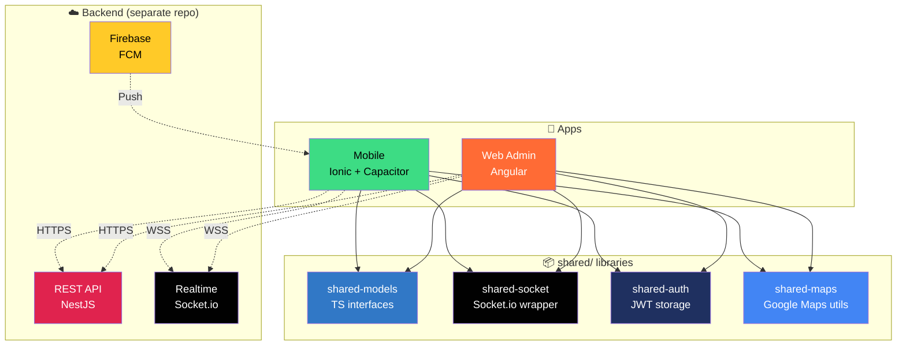

<!-- =================================================================== -->
<!--                            HERO SECTION                              -->
<!-- =================================================================== -->
<div align="center">

<a href="https://logiflowapp.z13.web.core.windows.net">
  
</a>

# LogiFlow — Frontend Monorepo

### *Real-time fleet interfaces for drivers and dispatchers · 2 apps · 4 shared libraries · 1 codebase*

<p>
  <a href="https://logiflowapp.z13.web.core.windows.net">
    
  </a>
  <a href="https://logiflow-api.eastus2.cloudapp.azure.com/api/v1/docs">
    
  </a>
  <a href="https://github.com/Logiflow-Gavilanes-ECI/logiflow">
    
  </a>
</p>

<p>
  <a href="https://github.com/Logiflow-Gavilanes-ECI/logiflow-front/actions/workflows/ci.yml">
    
  </a>
  <a href="https://github.com/Logiflow-Gavilanes-ECI/logiflow-front/actions/workflows/deploy-web-admin.yml">
    
  </a>
  
  
  
</p>

<p>
  
  
  
  
  
  
  
  
  
  
</p>

</div>

---

<!-- =================================================================== -->
<!--                         TWO-APP SHOWCASE                             -->
<!-- =================================================================== -->

<table>
<tr>
<td width="50%" valign="top" align="center">

### 📱 Mobile App

**Driver-facing Android app**

`apps/mobile` · `@logiflow/mobile`

🚀 **Ionic 8 + Angular 20 + Capacitor 8**

Live route map · trip status reports · push notifications

```
┌─────────────────────┐
│  LogiFlow — Driver  │
├─────────────────────┤
│  ●  Active trip     │
│  ━━━━━━━━━━━━━━━━━  │
│   🗺️  Live map       │
│  (Google Maps)      │
│  ━━━━━━━━━━━━━━━━━  │
│  [Start] [Arrived]  │
│        [Delivered]  │
├─────────────────────┤
│  📍 Stop 1 of 5     │
│  📍 Stop 2 of 5     │
│  📍 Stop 3 of 5     │
└─────────────────────┘
```

</td>
<td width="50%" valign="top" align="center">

### 🖥️ Web Admin

**Dispatcher dashboard**

`apps/web-admin` · `@logiflow/web-admin`

🚀 **Angular 20 + Ionic 8 components**

Real-time fleet map · vehicle tracking · event log

```
┌───────────────────────────────┐
│ LogiFlow — Control Center  ●  │
├──────────┬────────────────────┤
│Vehicles  │                    │
│ ▣ v-001  │    🗺️  Live Map    │
│ ▣ v-002  │  (Google Maps)     │
│ ▣ v-003  │                    │
├──────────┤   ● Vehicle 001    │
│Events    │   ● Vehicle 002    │
│ 14:23 ✓  │                    │
│ 14:25 →  │                    │
└──────────┴────────────────────┘
```

</td>
</tr>
<tr>
<td align="center">
  <a href="#-mobile-app--driver">
    
  </a>
</td>
<td align="center">
  <a href="https://logiflowapp.z13.web.core.windows.net">
    
  </a>
</td>
</tr>
</table>

> Both apps authenticate **exclusively via Google OAuth 2.0**. No email/password login exists in production.

---

<!-- =================================================================== -->
<!--                      ARCHITECTURE OVERVIEW                           -->
<!-- =================================================================== -->

## Architecture Overview



<div align="center">
  <em>Both apps share four typed TypeScript libraries to keep contracts in sync.</em>
</div>

---

<!-- =================================================================== -->
<!--                            NAVIGATION                                -->
<!-- =================================================================== -->

## Navigation

<table>
<tr>
<td align="center" width="20%">
  <a href="#-mobile-app--driver"><b>📱 Mobile App</b></a><br/>
  <sub>Ionic driver app</sub>
</td>
<td align="center" width="20%">
  <a href="#%EF%B8%8F-web-admin--dispatcher"><b>🖥️ Web Admin</b></a><br/>
  <sub>Angular dashboard</sub>
</td>
<td align="center" width="20%">
  <a href="#-shared-libraries"><b>📦 Shared Libs</b></a><br/>
  <sub>4 TypeScript libraries</sub>
</td>
<td align="center" width="20%">
  <a href="#quick-start"><b>🚀 Quick Start</b></a><br/>
  <sub>Run in 3 commands</sub>
</td>
<td align="center" width="20%">
  <a href="#cicd"><b>🤖 CI/CD</b></a><br/>
  <sub>Azure deploy pipeline</sub>
</td>
</tr>
</table>

---

<!-- =================================================================== -->
<!--                         APP DETAILS: MOBILE                          -->
<!-- =================================================================== -->

## 📱 Mobile App — Driver

> `apps/mobile` · `@logiflow/mobile` · **Ionic 8 + Angular 20 + Capacitor 8**

The driver-facing Android app. Drivers sign in with Google, see their assigned delivery route on an interactive Google Map, and report their trip status in real time.

### ✨ Key Features

<table>
<tr>
<td width="50%" valign="top">

- 🔐 **Google OAuth sign-in** (browser-based redirect via `?app=mobile`)
- 🗺️ **Live route map** with stop markers color-coded by status (pending / active / delivered)
- 📏 **Ordered polyline overlay** connecting all stops
- 🎯 **Trip status panel**: **Start** → **Arrived** → **Delivered** buttons with optimistic UI

</td>
<td width="50%" valign="top">

- 📡 **Socket.io updates** via `vehicle:<id>` room
- 🔔 **Firebase Cloud Messaging** push notifications for route updates
- 💪 **Offline-resilient** login and route loading
- ⚙️ **Capacitor plugins**: geolocation, push, preferences, browser, app

</td>
</tr>
</table>

### 🛣️ Trip Status Flow

```
[not started] ──Start──► [in_transit] ──Arrived──► [at_stop] ──Delivered──► advances to next stop
                                                                                  ▲
                                                                                  └── emits vehicle:status
                                                                                      to fleet room
```

### 📂 Screens / Routes

| Path | Component | Description |
|---|---|---|
| `/login` | `LoginPage` | Google sign-in with error handling |
| `/route` | `RoutePage` | Live map + stop list + status buttons |
| `/auth/callback` | `AuthCallbackComponent` | Handles OAuth redirect, stores JWT |

### 🤖 Android Build

```bash
cd apps/mobile
npm run build:android   # ng build + cap sync
npx cap open android    # open in Android Studio → run on device
```

📦 **APK output:** `apps/mobile/android/app/build/outputs/apk/debug/app-debug.apk`

<details>
<summary><b>Capacitor plugin list</b></summary>

<br/>

- `@capacitor/geolocation` — GPS tracking
- `@capacitor/push-notifications` — Firebase FCM integration
- `@capacitor/preferences` — Native key-value storage for JWT
- `@capacitor/browser` — OAuth redirect browser
- `@capacitor/app` — Deep links + lifecycle

</details>

---

<!-- =================================================================== -->
<!--                       APP DETAILS: WEB ADMIN                         -->
<!-- =================================================================== -->

## 🖥️ Web Admin — Dispatcher

> `apps/web-admin` · `@logiflow/web-admin` · **Angular 20 + Ionic 8**

The dispatcher-facing web dashboard. Admins sign in with Google and monitor the entire fleet in real time on an interactive Google Map.

### ✨ Three Views in One Dashboard

<table>
<tr>
<td width="33%" align="center" valign="top">

#### 📊 Dashboard

Live Google Map with directional vehicle arrows · Route polylines via Google Directions API · Color-coded event log · Vehicle detail panel

</td>
<td width="33%" align="center" valign="top">

#### 🚛 Fleet

Full vehicle roster · Status, plate, model, capacity, position · Click vehicle to see active route steps

</td>
<td width="33%" align="center" valign="top">

#### 🚨 Alerts

Real-time alert feed from the event log · Color-coded by severity · Auto-scroll

</td>
</tr>
</table>

### 🎨 Visual Indicators

| Visual cue | Meaning |
|:---:|:---|
| 🔵 **Cyan arrow** (`#00e5ff`) | Vehicle online, direction = bearing |
| 🔴 **Red arrow** (`#ff1744`) | Vehicle offline (15s grace timer) |
| 🟠 **Orange polyline** (`#ff6b35`) | Active route from Google Directions API |
| 💫 **6s toast notification** | New route received for any vehicle |
| 🔗 **Status indicator** | Connection status with reconnect button |

### 📂 Screens / Routes

| Path | Component | Guard | Description |
|---|---|---|---|
| `/login` | `LoginPage` | None | Google sign-in |
| `/auth/callback` | `AuthCallbackComponent` | None | OAuth redirect handler |
| `/home` | `HomePage` | `AuthGuard` (role: admin) | Full dashboard |

### 🌐 Live in Production

**Deploy target:** Azure Blob Storage Static Website
👉 [**https://logiflowapp.z13.web.core.windows.net**](https://logiflowapp.z13.web.core.windows.net)

### 💻 Local Development

```bash
cd apps/web-admin
npm start
# → http://localhost:4200
```

---

<!-- =================================================================== -->
<!--                         SHARED LIBRARIES                             -->
<!-- =================================================================== -->

## 📦 Shared Libraries

Four typed TypeScript libraries under [`shared/`](shared/) consumed by both apps via npm workspace paths. **One contract, two consumers, zero duplication.**

<details>
<summary><b>📐 @logiflow/shared-models — Domain types and event constants</b></summary>

<br/>

```typescript
// Route step statuses
ROUTE_STEP_STATUS.Pending   // 'pending'
ROUTE_STEP_STATUS.Active    // 'active'
ROUTE_STEP_STATUS.Completed // 'completed'

// Socket event names
SOCKET_EVENTS.RouteUpdate      // 'route:update'
SOCKET_EVENTS.VehiclePosition  // 'vehicle:position'
SOCKET_EVENTS.VehicleOffline   // 'vehicle:offline'
SOCKET_EVENTS.VehicleOnline    // 'vehicle:online'
```

**Key interfaces:** `Vehicle` · `Stop` · `DriverRoute` · `RouteStep` · `VehiclePositionEvent` · `RouteUpdateEvent` · `VehicleStatusEvent` · `JoinRoomAck`

</details>

<details>
<summary><b>📡 @logiflow/shared-socket — Typed Socket.io client wrapper</b></summary>

<br/>

```typescript
const socket = new LogiFlowSocketService({ url, auth: { token } });
await socket.connect();
socket.joinFleet();

socket.onRouteUpdate().subscribe(data => {
  console.log(`Route updated for ${data.vehicleId}`);
});

socket.onVehiclePosition().subscribe(data => {
  console.log(`Vehicle ${data.vehicleId} at ${data.lat}, ${data.lng}`);
});
```

**Reconnect config:** 10 attempts · 2s delay between attempts.

</details>

<details>
<summary><b>🔐 @logiflow/shared-auth — JWT storage & decoding</b></summary>

<br/>

```typescript
// Uses localStorage (web) or Capacitor Preferences (native)
authToken.setToken(jwt);
authToken.decodeClaims();   // → { sub, email, role, vehicleId, ... }
authToken.isExpired();
authToken.clearToken();
```

**Storage key:** `logiflow.auth.token`

</details>

<details>
<summary><b>🗺️ @logiflow/shared-maps — Google Maps loader + geo utilities</b></summary>

<br/>

```typescript
// Angular injectable service
await mapsService.loadGoogleMapsApi(apiKey);
const map = mapsService.createMap(element, options);

// Pure utility functions
haversineDistanceKm(pointA, pointB);
totalPolylineDistanceKm(points);
toGoogleLatLngLiteral(coordinates);
```

</details>

---

<!-- =================================================================== -->
<!--                          QUICK START                                 -->
<!-- =================================================================== -->

## Quick Start

### Prerequisites

- Node.js 20+
- A running [LogiFlow backend](https://github.com/Logiflow-Gavilanes-ECI/logiflow) (or use the live API)
- Google Maps API key

### Install

```bash
git clone https://github.com/Logiflow-Gavilanes-ECI/logiflow-front.git
cd logiflow-front
npm install   # installs all npm workspaces
```

### Run apps

<table>
<tr>
<td width="50%">

**🖥️ Web Admin**

```bash
cd apps/web-admin
npm start
# → http://localhost:4200
```

</td>
<td width="50%">

**📱 Mobile (browser preview)**

```bash
cd apps/mobile
npm start
# → http://localhost:8100
```

</td>
</tr>
</table>

### Typecheck all packages

```bash
# from repo root
npm run typecheck
```

---

<!-- =================================================================== -->
<!--                     ENVIRONMENT VARIABLES                            -->
<!-- =================================================================== -->

## Environment Variables

<details>
<summary><b>📱 Mobile (apps/mobile/src/environments/environment.ts)</b></summary>

<br/>

| Variable | Dev default | Description |
|---|---|---|
| `apiBaseUrl` | `http://localhost:3002/api/v1` | Gateway REST API base |
| `socketUrl` | `http://localhost:3001` | Realtime Socket.io URL |
| `googleMapsApiKey` | `''` | Google Maps JavaScript API key |
| `adminAppUrl` | `http://localhost:4200` | Web admin URL (redirect for admin-role users) |

> `environment.prod.ts` is not committed. Create manually or inject via CI. Same for `android/app/google-services.json` (Firebase).

</details>

<details>
<summary><b>🖥️ Web Admin (apps/web-admin)</b></summary>

<br/>

Injected at build time by `set-env.js` from OS environment variables:

| OS variable | Build target | Description |
|---|---|---|
| `API_URL` | `environment.apiUrl` | Gateway REST base URL |
| `REALTIME_URL` | `environment.realtimeUrl` | Socket.io URL |
| `GOOGLE_MAPS_API_KEY` | `environment.googleMapsApiKey` | Google Maps key |
| `DRIVER_APP_URL` | `environment.driverAppUrl` | Driver app URL (empty in prod — APK) |

**Production values (set in CI secrets):**

```
API_URL        = https://logiflow-api.eastus2.cloudapp.azure.com/api/v1
REALTIME_URL   = https://logiflow-api.eastus2.cloudapp.azure.com
DRIVER_APP_URL = (empty — driver app is an Android APK)
```

</details>

---

<!-- =================================================================== -->
<!--                              CI/CD                                   -->
<!-- =================================================================== -->

## CI/CD

### 🤖 Continuous Integration

Runs on every push and PR to `main`, `develop`, `feat/**`, `fix/**`:

```
┌─────────────┐
│  npm ci     │  ── workspace-aware install
└──────┬──────┘
       │
   ┌───┴────┬──────────┐
   ▼        ▼          ▼
typecheck   lint       (no tests in CI yet)
   │      web-admin
   │       only
```

> Mobile lint is not yet wired into CI. Web-admin uses Angular ESLint.

### 🚀 Continuous Deployment — Web Admin

Triggers automatically on every merge to `main` after CI passes:

```
Merge → CI green → npm run build (prod) ────► set-env.js injects API_URL, REALTIME_URL, GMAPS_KEY
                                                       │
                                                       ▼
                              ┌─────────────────────────────────────────────────┐
                              │  az storage blob upload-batch → Azure $web      │
                              │  cache-control: no-cache on index.html          │
                              └─────────────────────────────────────────────────┘
                                                       │
                                                       ▼
                              🌍 https://logiflowapp.z13.web.core.windows.net
```

**Required GitHub secrets:** `GOOGLE_MAPS_API_KEY` · `AZURE_STORAGE_ACCOUNT_NAME` · `AZURE_STORAGE_ACCOUNT_KEY`

> The mobile app has **no automated deploy pipeline**. APKs are built locally and distributed via Android Studio.

---

<!-- =================================================================== -->
<!--                        QUALITY METRICS                               -->
<!-- =================================================================== -->

## Quality Metrics

<table>
<tr>
<td width="33%" align="center" valign="top">

### 🧪 Test Coverage

**80.49 %**

260 / 323 statements

109 tests · 0 fails

`Karma + Istanbul`

</td>
<td width="33%" align="center" valign="top">

### 🛡️ Auth Flow

**0 LOC**

Email/password code

Google OAuth only

`?app=admin|mobile|web`

</td>
<td width="33%" align="center" valign="top">

### 📐 Type Safety

**100 %**

Strict TypeScript

Shared interfaces in `shared/models`

`tsc -b` across workspaces

</td>
</tr>
</table>

---

<!-- =================================================================== -->
<!--                       PROJECT STRUCTURE                              -->
<!-- =================================================================== -->

## Project Structure

```
logiflow-front/
├── .github/
│   └── workflows/
│       ├── ci.yml                    🤖 Typecheck + lint on every push/PR
│       └── deploy-web-admin.yml      🚀 Build + deploy to Azure on main
├── apps/
│   ├── mobile/                       📱 Ionic + Angular + Capacitor driver app
│   │   ├── android/                  Native Android project (Capacitor)
│   │   ├── src/app/
│   │   │   ├── auth-callback/        OAuth redirect handler
│   │   │   ├── core/                 Services, constants, runtime
│   │   │   ├── login/                Google sign-in page
│   │   │   ├── route/                Active route map + stop list
│   │   │   └── shared/components/    TripStatusComponent
│   │   └── capacitor.config.ts
│   └── web-admin/                    🖥️ Angular dispatcher dashboard
│       ├── src/app/
│       │   ├── auth-callback/        OAuth redirect handler
│       │   ├── core/                 Services, guards, models
│       │   ├── event-log/            Real-time event stream
│       │   ├── home/                 Dashboard shell (3 views)
│       │   ├── login/                Google sign-in page
│       │   ├── map/                  Google Maps component
│       │   └── vehicle-list/         Fleet sidebar
│       └── set-env.js                Build-time env injection
├── shared/
│   ├── auth/                         🔐 AuthTokenService + JWT utilities
│   ├── maps/                         🗺️ MapsService + geo utilities
│   ├── models/                       📐 Shared TS interfaces + constants
│   └── socket/                       📡 LogiFlowSocketService wrapper
├── tsconfig.base.json                Path aliases for shared libs
└── package.json                      npm workspaces root
```

---

<!-- =================================================================== -->
<!--                          DOCUMENTATION                               -->
<!-- =================================================================== -->

## Documentation

Architecture deliverables live in the [**backend repository**](https://github.com/Logiflow-Gavilanes-ECI/logiflow) under `docs/`:

<table>
<tr>
<th align="left">📄 Deliverable</th>
<th align="left">Link</th>
</tr>
<tr>
<td>📘 <b>Architecture Document</b></td>
<td><a href="https://github.com/Logiflow-Gavilanes-ECI/logiflow/blob/main/docs/LogiFlow-architecture.pdf">LogiFlow-architecture.pdf</a> · 40 pages</td>
</tr>
<tr>
<td>📰 <b>IEEE Article</b></td>
<td><a href="https://github.com/Logiflow-Gavilanes-ECI/logiflow/blob/main/docs/LogiFlow-article.pdf">LogiFlow-article.pdf</a> · 5 pages, IEEEtran format</td>
</tr>
<tr>
<td>📊 <b>Defense Slides</b></td>
<td><a href="https://github.com/Logiflow-Gavilanes-ECI/logiflow/blob/main/docs/LogiFlow-presentation.pptx">LogiFlow-presentation.pptx</a> · 18 slides</td>
</tr>
<tr>
<td>🎨 <b>UML Diagrams</b></td>
<td><a href="https://github.com/Logiflow-Gavilanes-ECI/logiflow/tree/main/docs/diagrams">docs/diagrams/</a> · 7 × PNG (Context, Components, ER, Sequence, Class, Deployment, Activity)</td>
</tr>
</table>

---

<!-- =================================================================== -->
<!--                              TEAM                                    -->
<!-- =================================================================== -->

## Team — Los Gavilanes del Código

<table>
<tr>
<td align="center" width="25%">
  <a href="https://github.com/AnderssonProgramming">
    <br/>
    <sub><b>Andersson David<br/>Sánchez Méndez</b></sub>
  </a><br/>
  <sub>🏗️ Architecture · CI/CD</sub>
</td>
<td align="center" width="25%">
  <a href="https://github.com/cris-eci">
    <br/>
    <sub><b>Cristian Santiago<br/>Pedraza Rodríguez</b></sub>
  </a><br/>
  <sub>🗺️ Maps · Route Visualization</sub>
</td>
<td align="center" width="25%">
  <a href="https://github.com/Eliza-05">
    <br/>
    <sub><b>Elizabeth<br/>Correa Suárez</b></sub>
  </a><br/>
  <sub>📱 Mobile · Capacitor</sub>
</td>
<td align="center" width="25%">
  <a href="https://github.com/Juanseom">
    <br/>
    <sub><b>Juan Sebastián<br/>Ortega Muñoz</b></sub>
  </a><br/>
  <sub>🖥️ Web Admin · Sockets</sub>
</td>
</tr>
</table>

<div align="center">
  <sub><b>Arquitecturas de Software (ARSW) · Escuela Colombiana de Ingenieria Julio Garavito · Mayo 2026</b></sub>
</div>

---

<!-- =================================================================== -->
<!--                            LICENSE                                   -->
<!-- =================================================================== -->

## License

<div align="center">

[](LICENSE)

MIT © 2026 LogiFlow — Escuela Colombiana de Ingenieria Julio Garavito

<br/>

<sub>Crafted with ⚡ Angular signals, 🗺️ Google Maps love, and 📱 Capacitor magic by Los Gavilanes del Código</sub>

</div>
