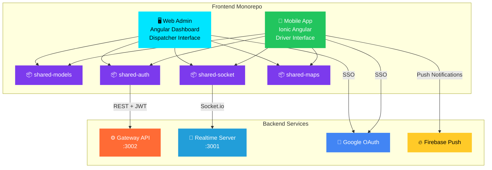
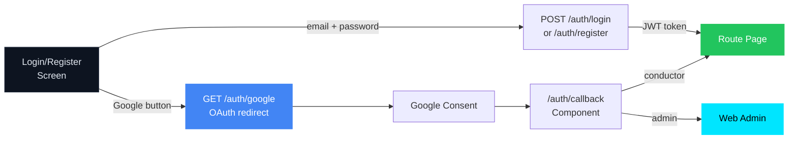
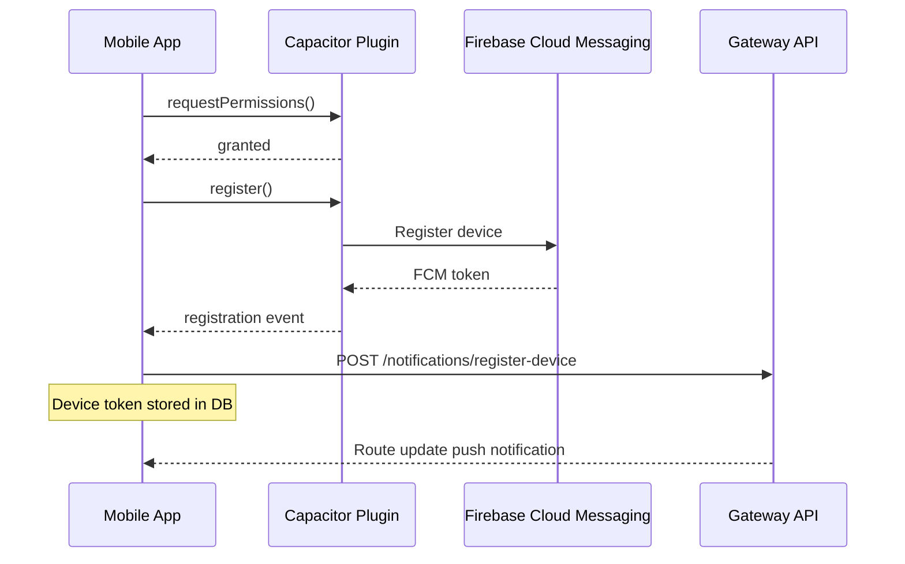

# 📱 LogiFlow — Frontend Monorepo

[](https://github.com/Logiflow-Gavilanes-ECI/logiflow-front/actions)
[](https://sonarcloud.io/summary/new_code?id=Logiflow-Gavilanes-ECI_logiflow-front)
[](https://angular.dev/)
[](https://ionicframework.com/)
[](https://www.typescriptlang.org/)
[](LICENSE)

```text
  ██╗      ██████╗  ██████╗ ██╗███████╗██╗      ██████╗ ██╗    ██╗
  ██║     ██╔═══██╗██╔════╝ ██║██╔════╝██║     ██╔═══██╗██║    ██║
  ██║     ██║   ██║██║  ███╗██║█████╗  ██║     ██║   ██║██║ █╗ ██║
  ██║     ██║   ██║██║   ██║██║██╔══╝  ██║     ██║   ██║██║███╗██║
  ███████╗╚██████╔╝╚██████╔╝██║██║     ███████╗╚██████╔╝╚███╔███╔╝
  ╚══════╝ ╚═════╝  ╚═════╝ ╚═╝╚═╝     ╚══════╝ ╚═════╝  ╚══╝╚══╝
          F R O N T E N D   M O N O R E P O
```

> **Two apps, one design system — delivering real-time fleet visibility to drivers and dispatchers.**

---

## 🗺️ Overview

This monorepo contains both LogiFlow frontend applications and their shared libraries. Both apps connect to the same backend services for real-time fleet tracking, route optimization, and vehicle management. Authentication supports both **email/password** and **Google OAuth 2.0** single sign-on.



---

## 📦 Workspace Layout

```text
logiflow-front/
├── apps/
│   ├── mobile/                 ← Driver-facing app (Ionic Angular)
│   │   ├── src/app/
│   │   │   ├── login/          ← Authentication (email + Google OAuth)
│   │   │   ├── register/       ← User registration (+ Google sign-up)
│   │   │   ├── route/          ← Active route + map + stop list + push init
│   │   │   ├── auth-callback/  ← OAuth redirect handler
│   │   │   ├── core/services/
│   │   │   │   ├── auth.service.ts
│   │   │   │   ├── push-notification.service.ts
│   │   │   │   ├── route.service.ts
│   │   │   │   └── driver-socket.service.ts
│   │   │   └── shared/
│   │   │       └── components/
│   │   │           └── trip-status/  ← Start/Arrive/Deliver controls
│   │   └── src/theme/
│   │       └── variables.scss  ← Design system tokens
│   │
│   └── web-admin/              ← Dispatcher dashboard (Angular)
│       └── src/app/
│           ├── login/          ← Admin auth (email + Google OAuth)
│           ├── auth-callback/  ← OAuth redirect handler
│           ├── home/           ← Dashboard layout (sidebar + map)
│           ├── map/            ← Live fleet map component
│           ├── vehicle-list/   ← Vehicle cards with status
│           └── event-log/      ← Real-time event stream
│
└── shared/
    ├── models/                 ← @logiflow/shared-models
    ├── socket/                 ← @logiflow/shared-socket
    ├── auth/                   ← @logiflow/shared-auth
    └── maps/                   ← @logiflow/shared-maps
```

---

## 🎨 Design System

Both apps share a consistent dark theme built with CSS custom properties.

| Token | Value | Usage |
|-------|-------|-------|
| `--lf-bg-deep` | `#050810` | Page background |
| `--lf-bg-base` | `#080c14` | Content background |
| `--lf-bg-card` | `#0d1420` | Card surfaces |
| `--lf-bg-elevated` | `#111827` | Elevated elements |
| `--lf-cyan` | `#00e5ff` | Primary accent |
| `--lf-orange` | `#ff6b35` | Secondary accent |
| `--lf-green` | `#22c55e` | Success / Online |
| `--lf-red` | `#ef4444` | Error / Offline |
| `--lf-purple` | `#a78bfa` | Tertiary accent |

### Gradients

| Token | Value |
|-------|-------|
| `--lf-gradient-primary` | `linear-gradient(135deg, #00e5ff, #229ED9, #7c3aed)` |
| `--lf-gradient-warm` | `linear-gradient(135deg, #ff6b35, #f59e0b)` |
| `--lf-gradient-bg` | `linear-gradient(180deg, #080c14, #0a1628, #0d1117)` |

### Typography

- **Font:** Space Mono (monospace)
- **Weights:** 400 (regular), 700 (bold)
- **Letter spacing:** 1–4px for labels, 2–3px for headings

---

## 📱 Mobile App (Driver)

The mobile app is built with **Ionic Angular v8** targeting Android and iOS.

### Screens

| Screen | Purpose |
|--------|---------|
| **Login** | JWT auth with email/password + Google OAuth sign-in |
| **Register** | New user registration (email, password, role) + Google sign-up |
| **Route** | Active delivery route with live map, stop list, trip controls, push notification init |
| **Auth Callback** | Handles Google OAuth redirect, stores token, redirects by role |

### Key Features

- Real-time position tracking via Socket.io
- Interactive map with route polyline visualization
- Trip status controls (Start → Arrived → Delivered)
- **Google OAuth** single sign-on with "Sign in with Google" button
- **Firebase Push Notifications** — receives route updates even when app is backgrounded
- Automatic redirect: `conductor` → route view, `admin` → web dashboard
- Responsive from 320px to tablet (768px+)
- Pulse animation on active stop badges

### Authentication Flow



### Push Notification Flow



---

## 🖥️ Web Admin (Dispatcher)

The web admin dashboard provides a real-time fleet operations view.

### Layout

```text
┌─────────────────────────────────────────────┐
│  🔵 LOGIFLOW  ·  FLEET CONTROL              │
├──────────┬──────────────────────────────────┤
│ Vehicle  │                                   │
│ List     │        Live Fleet Map             │
│ ┌──────┐ │                                   │
│ │ v-001│ │     🚛  ────── 🚛                 │
│ │ v-002│ │          🚛                       │
│ └──────┘ │                                   │
│──────────│                                   │
│ Event    │                    [Route Toast]   │
│ Log      │                                   │
├──────────┴──────────────────────────────────┤
│  Error Banner (if socket disconnected)       │
└─────────────────────────────────────────────┘
```

### Components

| Component | Description |
|-----------|-------------|
| **Login** | Email/password auth + Google OAuth "Continuar con Google" button |
| **Auth Callback** | Handles Google OAuth redirect for web admin |
| **Vehicle List** | Stats bar (online/offline/routes) + vehicle cards with lat/lng/speed |
| **Map** | Leaflet map with vehicle markers, route polylines, skeleton loading |
| **Event Log** | Color-coded real-time event stream (system/position/route/offline) |
| **Error Banner** | Socket disconnection warning with reconnect button |

### Responsive Breakpoints

| Breakpoint | Layout |
|------------|--------|
| `> 768px` | Sidebar (320px) + Map |
| `600–768px` | Sidebar (260px) + Map |
| `< 600px` | Stacked: Vehicle list → Map |

---

## 🚀 Getting Started

### Prerequisites

| Tool | Version |
|------|---------|
| [Node.js](https://nodejs.org/) | 22+ |
| [npm](https://www.npmjs.com/) | 10+ |
| [Ionic CLI](https://ionicframework.com/docs/cli) | 8+ |

### Install & Run

```bash
# Clone and install
git clone https://github.com/Logiflow-Gavilanes-ECI/logiflow-front.git
cd logiflow-front
npm install

# Copy environment config
cp .env.example .env

# Run mobile app (development)
cd apps/mobile
npx ionic serve

# Run web-admin (development)
cd apps/web-admin
npx ionic serve --port 8100
```

### Build

```bash
# Type-check all workspaces
npm run typecheck

# Build all workspaces
npm run build
```

---

## 📚 Shared Libraries

### `@logiflow/shared-models`
Central TypeScript interfaces for vehicles, stops, and real-time event payloads. Socket event name constants used by both apps.

### `@logiflow/shared-socket`
Typed Socket.io client service with room join/subscribe workflows. Handles `route:update`, `vehicle:position`, `vehicle:online`, and `vehicle:offline` events.

### `@logiflow/shared-auth`
Token storage abstraction with JWT payload decode and expiration checks. Manages access + refresh token lifecycle. Provides `AUTH_TOKEN_KEY` constant and `AuthTokenService` class.

### `@logiflow/shared-maps`
Google Maps API loader, map creation helpers, Haversine distance calculations, and route distance fallback for polyline points.

---

## ⚙️ Environment Variables

| Variable | Example | Description |
|----------|---------|-------------|
| `LOGIFLOW_API_BASE_URL` | `http://localhost:3002` | Gateway REST API base URL |
| `LOGIFLOW_SOCKET_URL` | `http://localhost:3001` | Realtime WebSocket URL |
| `LOGIFLOW_GOOGLE_MAPS_API_KEY` | `AIza...` | Google Maps API key |
| `LOGIFLOW_ADMIN_APP_URL` | `http://localhost:8100` | Web admin URL (for role redirect) |
| `LOGIFLOW_DRIVER_APP_URL` | `http://localhost:4200` | Mobile app URL (for role redirect) |

---

## 🧪 Testing

```bash
# Run tests for a specific app
cd apps/mobile
npm test

# Type-check everything
npm run typecheck
```

---

## 🔌 Backend Integration

| Backend Service | Frontend Usage | Connection |
|----------------|----------------|------------|
| **Gateway** `:3002` | Auth (JWT + Google OAuth), vehicle/stop CRUD, route optimization, device registration | REST + JWT |
| **Realtime** `:3001` | Live position, route updates, online/offline | Socket.io + JWT |
| **Firebase** | Push notifications for route updates to mobile drivers | FCM SDK (Capacitor) |

### Socket.io Rooms

| Room | Joined By | Events Received |
|------|-----------|-----------------|
| `fleet` | Web Admin | All vehicle positions + routes |
| `vehicle:{id}` | Mobile App | Position + route for specific vehicle |

---

## 👥 Team

| Name | Handle | Area |
|------|--------|------|
| **Andersson David Sánchez Méndez** | @AnderssonProgramming | Architecture + CI/CD |
| **Cristian Santiago Pedraza Rodríguez** | @cris-eci | Map Integration |
| **Elizabeth Correa Suárez** | @Eliza-05 | Mobile App |
| **Juan Sebastian Ortega Muñoz** | @Juanseom | Web Admin |

---

## 📄 License

MIT © 2026 LogiFlow — Escuela Colombiana de Ingeniería Julio Garavito
